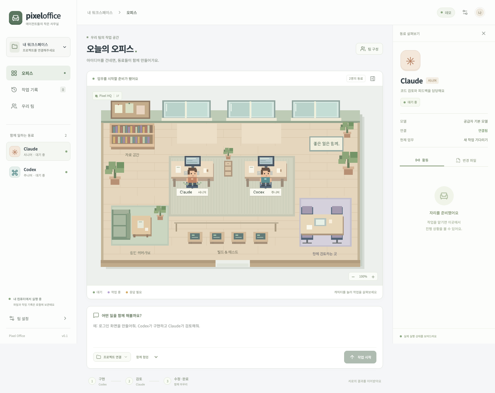
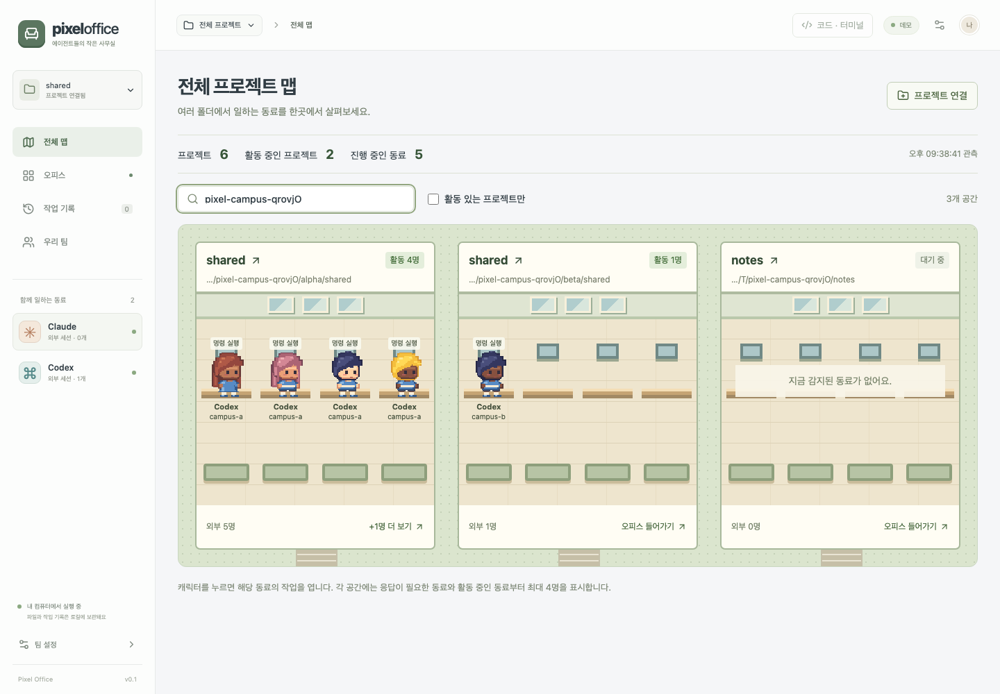
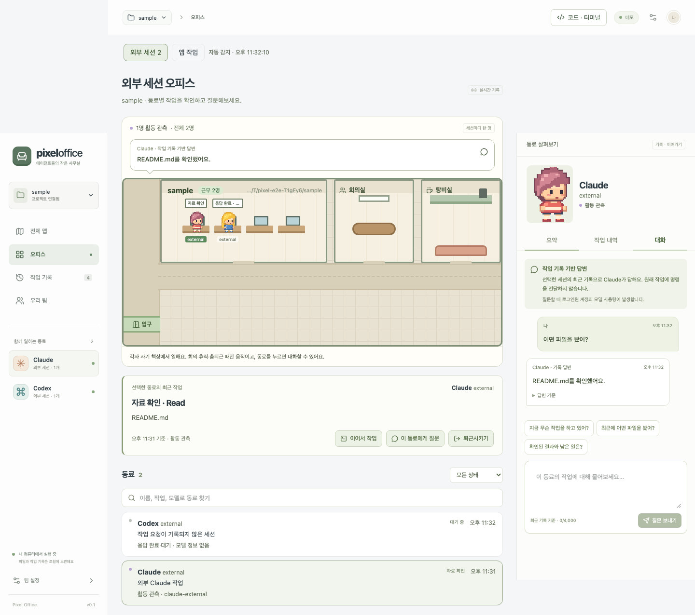
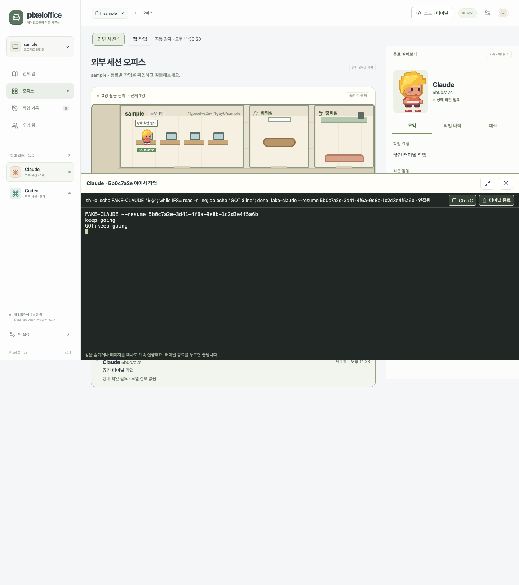
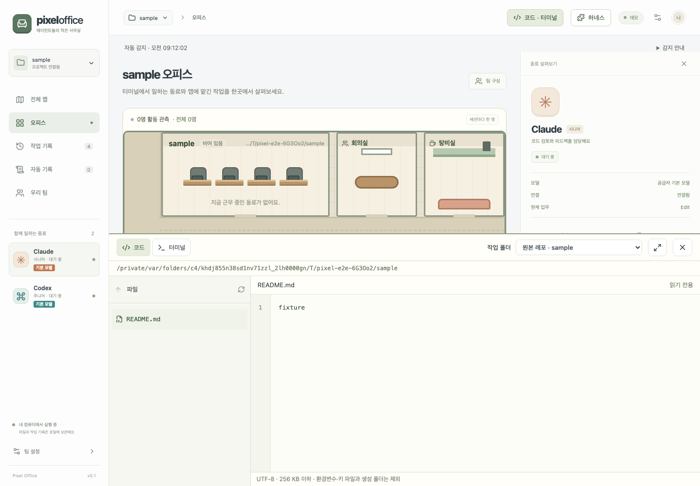
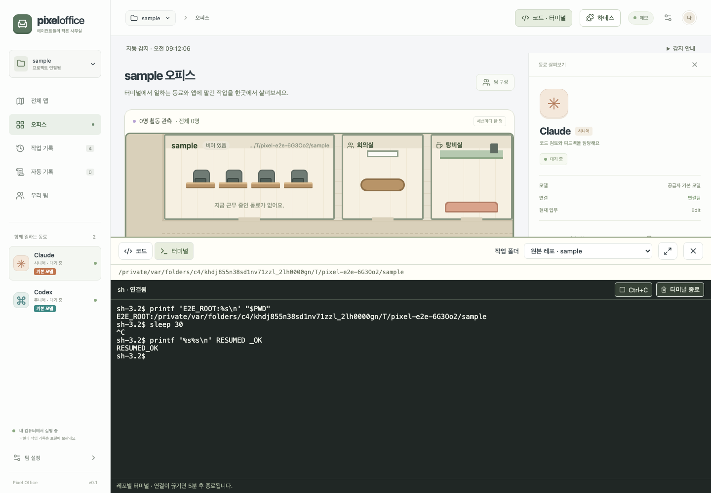
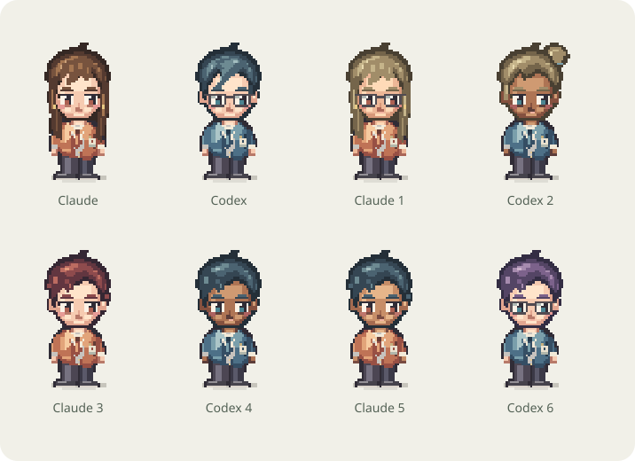

# Pixel Office

Claude Code와 Codex가 함께 일하는 로컬 픽셀 사무실입니다. 프로젝트와 작업을 지정하면 에이전트가 구현·검토·수정을 이어가고, 캐릭터를 선택해 실제 작업 메시지와 변경 파일을 확인할 수 있습니다.



## 시작하기

Node.js **24 이상**, Git, 로그인된 [Codex CLI](https://learn.chatgpt.com/codex)와 [Claude Code](https://code.claude.com/docs/en/overview)가 필요합니다. 현재 검증 환경은 macOS입니다.

```bash
git clone https://github.com/seongyeon1/pixel-office.git
cd pixel-office
npm install
npm run dev
```

터미널에 출력되는 `http://127.0.0.1:4317/#token=...` 연결 URL을 브라우저에서 여세요. 토큰은 앱 연결용이며 공급자 API 키가 아닙니다. 다른 기기에 공유하지 마세요.

프로덕션 빌드로 실행하려면:

```bash
npm run build
npm start
```

공급자 로그인이 필요하면 각각의 공식 CLI에서 로그인하세요.

```bash
codex login
claude auth login
```

CLI 설치·로그인 상태와 실제 작업 성공은 별개입니다. 선택 모델의 계정 접근 권한이나 실행 한도에 문제가 있으면 화면에 해당 오류가 표시됩니다. 실제 실행에는 각 공급자의 구독 또는 API 사용 정책이 적용됩니다.

## 사용 흐름

1. **프로젝트 연결**에서 최초 커밋이 있는 Git 프로젝트의 절대 경로를 입력합니다.
2. **팀 구성**에서 각 에이전트의 모델과 시니어·주니어·신입 페르소나를 설정합니다. 모델 목록을 불러오며 직접 식별자를 입력할 수도 있습니다. 비워두면 공급자 기본 모델을 사용합니다.
3. 작업 내용을 입력하고 협업 또는 단독 실행을 선택합니다.
4. **작업 시작**을 누릅니다. 협업은 기본적으로 Codex 구현 → Claude 검토 → 필요시 수정 순서이며 역할을 바꿀 수 있습니다.
5. 캐릭터 또는 동료 목록을 선택해 메시지·도구 실행·변경 파일을 봅니다. 승인이나 질문이 필요하면 상세 패널에서 응답합니다.
6. 완료 후 작업 결과, 별도 작업 폴더, 브랜치를 확인합니다. 실행 도중에는 **작업 중단**을 사용할 수 있습니다.

직급은 실제 연차나 성능 순위가 아닌 작업 지침입니다. 시니어는 구조·위험·판단 근거, 주니어는 구현·테스트, 신입은 작은 작업과 질문·검토 요청에 집중합니다. 직급을 바꾸어도 실행 권한은 확대되지 않습니다.

## 레포별로 보기

상단 **레포 전환** 버튼이나 왼쪽 프로젝트 이름을 누르면 연결된 레포 목록이 열립니다. 각 레포의 전체 경로, 최근 상태, 누적 작업 수를 확인하고 전환할 수 있습니다.

- 레포를 선택하면 해당 레포의 최근 작업과 오피스를 불러오고, 작업 기록·메시지·변경 파일을 분리해 보여줍니다.
- 새 레포는 목록 아래에서 Git 프로젝트 경로로 연결합니다. 레포 목록은 서버에, 마지막 선택은 브라우저에 저장됩니다.
- 기존 실행 기록이 있는 레포도 자동으로 목록에 포함됩니다. 이름이 같아도 전체 경로가 다르면 별도 레포입니다.
- 다른 레포에서 작업 중이면 상태와 **작업 보러 가기** 버튼을 표시합니다. 화면 전환은 실행 중인 작업을 중단하지 않습니다.
- 작업 기록은 선택한 레포의 최근 100개를 표시합니다. 레포 목록의 작업 수는 전체 누적 수입니다.
- 삭제되거나 이동한 레포도 보관된 기록을 열 수 있습니다. 새 작업을 시작하려면 유효한 경로가 필요합니다.

앱에서 시작하는 작업은 전체에서 한 개씩 진행합니다. 외부 세션 관측은 여러 레포·세션을 동시에 표시합니다.

## 여러 프로젝트를 한 맵에서 보기

왼쪽 **전체 맵**을 누르면 모든 프로젝트가 한 층짜리 사무실로 표시됩니다. 레포마다 방이 하나씩 있고, 회의실·탕비실·입구는 복도와 왼쪽 통로로 이어집니다. 프로젝트를 전환하지 않고 여러 곳의 활동을 함께 볼 수 있습니다.



- **방 = 레포, 책상 줄 = 워크트리.** 같은 레포의 여러 워크트리에서 일하는 세션은 같은 방에 앉고, 워크트리마다 브랜치 이름표가 붙습니다. 작업이 끝나 지운 워크트리의 세션도 원래 레포 방에 남습니다.
- **출근과 퇴근.** 새로 감지된 세션은 입구로 들어와 자기 자리에 앉습니다. 터미널이 닫히면(Claude) 바로, 마지막 활동 뒤 30분이 지나면 입구로 걸어 나가 **최근 퇴근** 목록으로 옮겨집니다. 사람의 답을 기다리는 동료는 퇴근하지 않습니다.
- **머리 위 표시.** `?`는 질문(`AskUserQuestion`, Codex 입력 요청)이나 계획 승인(`ExitPlanMode`)을 기다리는 상태입니다. 점선 `?`는 도구가 1분 넘게 결과 없이 멈춰 있어 권한 승인을 기다리는 것으로 추정되는 상태입니다. `!`는 작업을 끝내고 보고가 있는 상태이며, 캐릭터를 눌러 열면 사라집니다.
- **협업 동선.** subagent는 자기를 띄운 세션 옆자리에서 일하다 끝나면 퇴근합니다. 앱 협업 작업의 리뷰 단계에서는 구현 담당이 리뷰어 옆으로 갑니다. 같은 레포에서 여러 명이 동시에 일하면 가끔 회의실에 모이고, 한가한 동료는 가끔 탕비실에 들릅니다.
- 방마다 책상 줄은 최대 3개까지 보여 주고, 넘치는 인원은 **+N명 더 보기**로 표시합니다. 캐릭터를 누르면 해당 프로젝트와 세션을 바로 선택하고, 프로젝트 이름을 누르면 해당 오피스가 열립니다.
- 이름·경로 검색과 **활동 있는 프로젝트만** 필터를 지원합니다. 전체 맵을 보고 새로고침해도 같은 화면으로 돌아옵니다.
- 코드와 터미널은 프로젝트 오피스에 들어간 뒤 열 수 있습니다.

## 이미 실행 중인 세션 보기

앱을 켜면 이 컴퓨터의 Claude Code·Codex 로그를 자동으로 탐색합니다. **레포 전환 → 외부 세션**에서 이미 진행 중인 작업을 확인하세요. 같은 레포에서 여러 세션이 발견되면 목록에서 하나를 선택할 수 있습니다.

- 읽기·수정·명령 실행, 최근 메시지, 모델, 실제 작업 폴더를 표시합니다. 새 파일 발견은 약 10초, 활동 반영은 약 2~4초 간격입니다.
- Git worktree 세션은 원래 저장소로 묶고, 각 세션의 작업 폴더도 표시합니다.
- **활동 관측**은 최근 로그 기준입니다. **응답 완료·대기**는 한 응답이 끝난 상태, **상태 확인 필요**는 2분 이상 새 활동을 확인하지 못한 상태입니다.
- 외부 세션의 기록을 읽어 표시합니다. **이어서 작업**으로 CLI 대화를 재개할 수 있으며, 원래 실행 중인 프로세스의 터미널을 가져오는 방식은 아닙니다.
- 최근 7일의 로그와 열린 세션 후보 중 최대 200개를 읽습니다. Claude 세션 레지스트리와 Codex writer-lock 후보를 우선 포함합니다.
- 기본 위치는 `~/.codex/sessions`와 `~/.claude/projects`입니다. `CODEX_HOME`과 `CLAUDE_CONFIG_DIR`로 변경된 위치도 지원합니다.
- 로컬 로그를 남기지 않는 세션이나 다른 컴퓨터·컨테이너 안의 세션은 감지하지 못할 수 있습니다.

상태 해석과 저장 범위는 [외부 세션 관측](docs/external-sessions.md)에 정리했습니다.

## 동료에게 질문하기



외부 세션 화면에서 캐릭터나 동료 목록을 선택하세요. 같은 Codex·Claude도 실행 세션마다 별도 캐릭터로 표시합니다.

- **요약**: 작업 요청, 최근 활동, 모델과 작업 폴더를 확인합니다.
- **작업 내역**: 시간순 기록을 읽고 필요한 도구 실행 내용을 펼칩니다. 긴 실행 코드는 기본적으로 접습니다.
- **대화**: 질문을 입력하거나 빠른 질문을 누릅니다. 답변은 캐릭터의 말풍선과 대화 패널에 함께 표시됩니다.
- 이름·작업·모델 검색과 상태 필터로 동료를 찾습니다. 오피스는 페이지당 최대 8명을 표시합니다.
- 질문과 답변은 세션별로 SQLite에 보관하며 최근 100개 메시지를 표시합니다. 새로고침·서버 재시작 후에도 남습니다. **답변 중단**은 별도 답변 생성만 취소합니다.

**작업 기록 기반 답변**은 선택한 세션의 최근 최대 24개 이벤트와 해당 대화 일부를 같은 공급자의 별도 요청에 전달합니다. 원래 실행 중인 에이전트에 직접 질문을 보내거나 작업을 지시하는 기능은 아닙니다. 관측되지 않은 파일·테스트 결과는 확인할 수 없습니다.

질문 시 기존 CLI 로그인과 공급자 기본 모델을 사용하며 모델 사용량이 발생합니다. 원본 작업 모델과 답변 모델은 다를 수 있고, 답변 아래 **답변 기준**에서 실제 모델과 기록 시각을 확인할 수 있습니다. 앱 내부 작업의 승인·질문 응답 화면은 기존대로 유지합니다.

## 원래 세션 이어가기와 퇴근

캐릭터를 누르고 최근 작업 카드의 **이어서 작업**을 선택하세요. 하단 터미널에서 **이어서 작업**을 누르면 Claude는 `claude --resume <세션 ID>`, Codex는 `codex resume <세션 ID>`로 원래 대화를 불러옵니다. 여기서 입력한 내용은 실제 에이전트에 전달되며, 명령 승인과 중단도 터미널에서 진행합니다. **대화** 탭의 기록 기반 질문과는 별도 기능입니다.

- 원래 프로세스가 살아 있거나 최근 활동 중이면 중복 재개를 막습니다. 원래 작업을 종료한 뒤 재개하거나 **복제해서 이어가기**로 대화 기록을 가진 새 세션을 여세요. 복제는 대화만 복제하며 파일 작업 폴더는 공유합니다.
- 원래 `cwd`에서 실행하므로 worktree 세션도 같은 폴더를 사용합니다. 폴더가 삭제됐다면 먼저 복구해야 합니다. 임의의 원본 레포로 바꾸어 실행하지 않습니다.
- 같은 세션을 여러 번 눌러도 앱에서는 하나의 터미널에 다시 연결합니다. 창 숨기기·프로젝트 전환·새로고침 후에도 살아 있으며, 명시적으로 종료하거나 앱 서버가 종료될 때 끝납니다. 일반 레포 셸과 합쳐 최대 8개를 지원합니다.
- **퇴근시키기 → 퇴근 확인**은 맵과 활성 동료 목록에서 숨기고, 앱에서 연 해당 이어가기 터미널과 기록 답변 생성을 종료합니다. 원본 로그·작업 파일·worktree는 삭제하지 않습니다. 다른 터미널·IDE에서 실행 중인 원래 프로세스는 중단하지 않습니다.
- 전체 맵이나 오피스 아래 **직접 퇴근시킨 동료**를 펼쳐 **다시 출근**할 수 있습니다. 퇴근 상태는 서버 재시작 후에도 유지됩니다. 원본 로그가 관측 범위를 벗어났다면 원래 CLI에서 세션을 열어 다시 감지시켜 주세요.



로컬 CLI 설치와 로그인이 필요하며, 이어서 보낸 작업은 공급자 모델 사용량을 발생시킵니다. 기존 CLI의 승인·샌드박스 설정을 사용합니다.

## 오피스 안에서 코드와 터미널 사용하기

상단 **코드 · 터미널**을 누르면 하단 작업 공간이 열립니다. 확대 버튼으로 더 넓게 볼 수 있습니다.

- **코드**: 폴더와 파일을 선택해 줄 번호가 있는 읽기 전용 미리보기를 엽니다. 새로고침 버튼으로 에이전트가 수정한 내용을 다시 읽습니다. UTF-8 텍스트 256 KB 이하를 지원하며, 심볼릭 링크·환경변수·키 파일과 `.git`, `.pixel`, `node_modules`, `dist`, `.next`는 제외합니다. 디렉터리마다 최대 500개 항목을 표시합니다.
- **작업 폴더**: 원본 레포와 선택한 앱 실행의 별도 worktree를 구분합니다. 에이전트가 변경한 코드를 보려면 **앱 작업 폴더**를 선택하세요.
- **터미널**: **터미널 시작**을 누르면 선택한 폴더에서 실제 로컬 셸을 엽니다. 명령 입력, 대화형 프로그램, `Ctrl+C`, 화면 크기 변경을 지원합니다. 명령은 로컬 사용자 권한으로 실행되며 실제 파일을 변경할 수 있습니다. 파일 미리보기의 경로 제한은 셸 샌드박스를 의미하지 않습니다.
- 패널을 닫거나 레포를 바꿔도 터미널은 남습니다. 같은 브라우저 탭에서 5분 안에 돌아오면 출력과 현재 셸에 다시 연결합니다. 네트워크가 끊기면 **다시 연결**, 완전히 닫으려면 **터미널 종료**를 사용합니다. 연결이 없는 터미널은 5분 뒤 정리하며 서버 종료 시에도 종료합니다.
- 최대 8개 터미널을 지원하고, 재연결 시 최근 출력 약 256K 문자를 재생합니다. 원래 Claude/Codex 실행 세션에 입력하는 기능이 아니라 사용자가 여는 별도의 셸입니다. 이 셸에서 CLI를 직접 실행할 수도 있습니다.




터미널 UI는 [xterm.js](https://xtermjs.org/docs/), 실제 셸 연결은 [node-pty](https://github.com/microsoft/node-pty)를 사용합니다. 현재 셸 실행은 macOS/Linux를 대상으로 하며, macOS prebuilt 보조 실행 파일의 권한은 설치 스크립트가 보정합니다. 네이티브 바이너리가 없는 플랫폼에서 설치하려면 Python과 C/C++ 빌드 도구가 필요할 수 있습니다.

## 맵에서 움직이는 동료

레포 오피스는 전체 맵의 방 하나를 크게 보여 줍니다. 레포 방 옆에 회의실과 탕비실이 있고, 동료는 워크트리별 책상 줄에서 **자기 자리를 지킵니다.** 코드 작성·자료 확인·명령 실행 같은 작업 종류는 자리 이동이 아니라 머리 위 말풍선으로 보여 줍니다. 명령을 실행 중이라는 표시만으로 테스트 성공을 의미하지는 않습니다.

동료가 움직이는 때는 전체 맵과 같습니다. 출근·퇴근할 때, subagent가 부모 옆자리로 올 때, 같은 레포에서 여러 명이 일해 가끔 회의실에 모일 때, 한가한 동료가 탕비실에 들를 때입니다. 오피스에서는 인원만큼 책상 줄을 늘리므로 페이지를 넘기지 않습니다. 퇴근한 동료는 방에서 빠지고 아래 동료 목록에서 볼 수 있습니다. 이동 중에도 캐릭터를 눌러 작업 내역과 대화를 열 수 있으며, OS의 이동 줄이기 설정을 따릅니다. 앱 내부 작업의 Canvas는 기존처럼 작업 상태에 따라 이동합니다.

## 픽셀 캐릭터



32×40 픽셀의 큰 머리와 작은 몸, 점눈과 볼터치로 귀여운 캐릭터를 표현합니다. 헤어스타일 4종과 머리색·피부색·티셔츠·원피스 조합은 세션 ID로 정해져 새로고침 후에도 유지됩니다. Claude는 코랄색, Codex는 파란색 옷으로 구분합니다. 오피스와 상세 패널은 같은 픽셀 원본을 사용합니다.

## 프로젝트와 기록

- 한 번에 한 작업을 실행하며 두 에이전트는 같은 worktree를 순서대로 사용합니다.
- 원본 프로젝트의 마지막 커밋에서 `pixel/<실행 ID>` 브랜치와 별도 worktree를 만듭니다. **커밋되지 않은 원본 변경은 작업에 포함되지 않습니다.**
- 앱이 원본 브랜치를 자동 병합하거나 원격으로 푸시하지 않습니다.
- 작업 폴더는 `.pixel/workspaces/`, 실행 기록은 `.pixel/office.sqlite`에 보관합니다. 결과 파일은 실패·중단 후에도 보존합니다.
- 브라우저를 새로고침해도 서버에서 작업은 계속됩니다. 서버 재시작 후 진행 중이던 작업은 중단된 기록으로 남으며 자동 재실행하지 않습니다.
- 검토 후 수정은 최대 2회입니다. 해결되지 않은 지적이나 검증 불가능한 결과는 **확인 필요**로 표시됩니다.

완료된 결과를 원본에 반영하려면 화면에 표시된 **작업 폴더**에서 변경 내용을 검토하고 커밋한 뒤, 원본 저장소에서 해당 작업 브랜치를 병합하세요. 원본에 미커밋 변경이 있다면 먼저 정리해야 합니다. 앱은 worktree를 자동 삭제하지 않습니다.

## 로컬 실행 설정

| 환경 변수        | 기본값   | 용도                            |
| ---------------- | -------- | ------------------------------- |
| `PORT`           | `4317`   | 로컬 서버 포트                  |
| `PIXEL_DATA_DIR` | `.pixel` | 실행 기록과 작업 폴더 저장 경로 |

서버는 `127.0.0.1`에만 연결합니다. 실행 제어 API는 연결 세션과 동일 출처 검사를 요구합니다. 에이전트별 명령 승인과 샌드박스는 유지합니다. **검토 에이전트는 소스를 수정하지 않는 역할**이며 검증 도구가 쓰기 권한을 요구하면 실행에 제한이 있을 수 있습니다.

## 검증

```bash
npm test
npm run typecheck
npm run build
npx playwright install chromium
npm run test:e2e
```

브라우저 테스트는 별도 샘플 Git 저장소와 **데모** 공급자를 사용해 승인·질문·중단·복구 흐름을 재현합니다. 실제 계정 실행 검증은 별도 명령입니다.

```bash
npm run smoke -- --provider codex
npm run smoke -- --provider claude
npm run smoke -- --collaborate
npx tsx scripts/chat-smoke.ts # 실제 Claude·Codex 기록 질문 검증 (모델 사용량 발생)
```

Smoke 검증은 임시 샘플 저장소에서만 작은 덧셈 함수를 구현·검토합니다. 알려진 샘플 파일 수정과 제한된 검증 명령만 테스트 하네스가 승인하며, 일반 앱은 사용자가 화면에서 승인합니다. 임시 작업 폴더 위치를 마지막에 출력합니다.

검증 결과와 현재 범위는 [검증 기록](docs/verification.md)에 정리했습니다.

## 구성

- `src/client`: React UI, Canvas 픽셀 사무실, 실시간 상태 표시
- `src/server/adapters`: Codex App Server / Claude Agent SDK 연결
- `src/server/orchestrator.ts`: 구현·검토·수정 및 승인 상태 관리
- `src/server/projects.ts`: Git worktree와 변경 파일 수집
- `src/server/observation`: 외부 세션 자동 탐색·증분 읽기·레포 매핑
- `src/server/chat.ts`: 세션별 기록 질문, 답변 생성·취소·시간 제한
- `src/server/store.ts`: SQLite 실행·이벤트·승인·대화 기록
- `src/server/transport.ts`: 로컬 HTTP / WebSocket과 세션 인증

첫 버전은 로컬 단일 사용자, 두 에이전트의 순차 협업에 집중합니다. 앱이 관리하는 여러 프로젝트의 동시 실행과 모델 자동 성능 평가는 포함하지 않습니다. 외부 세션 관측은 여러 레포를 지원합니다.
