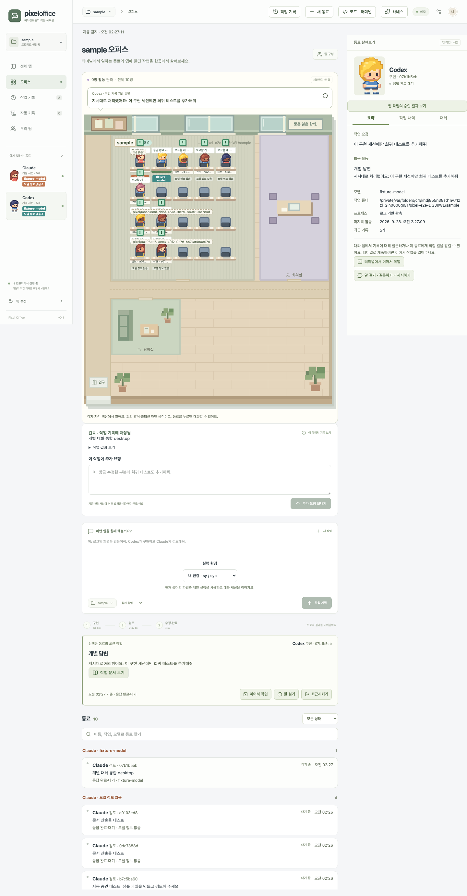
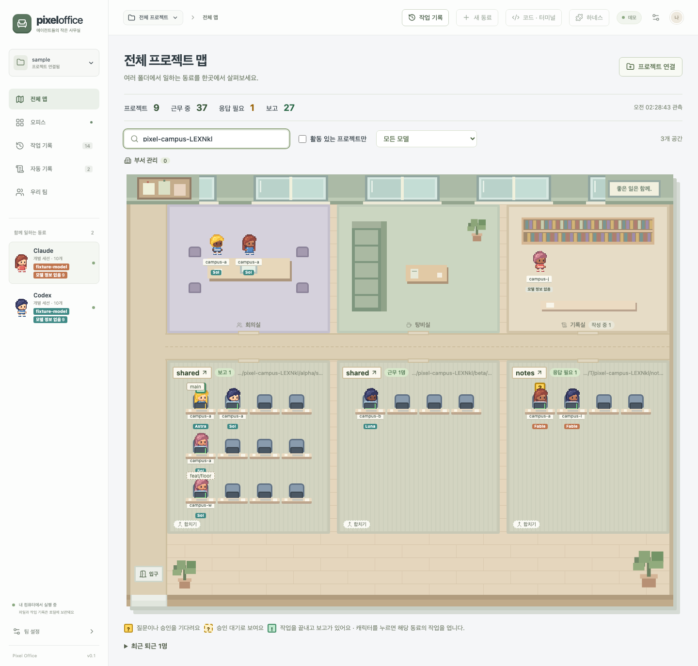
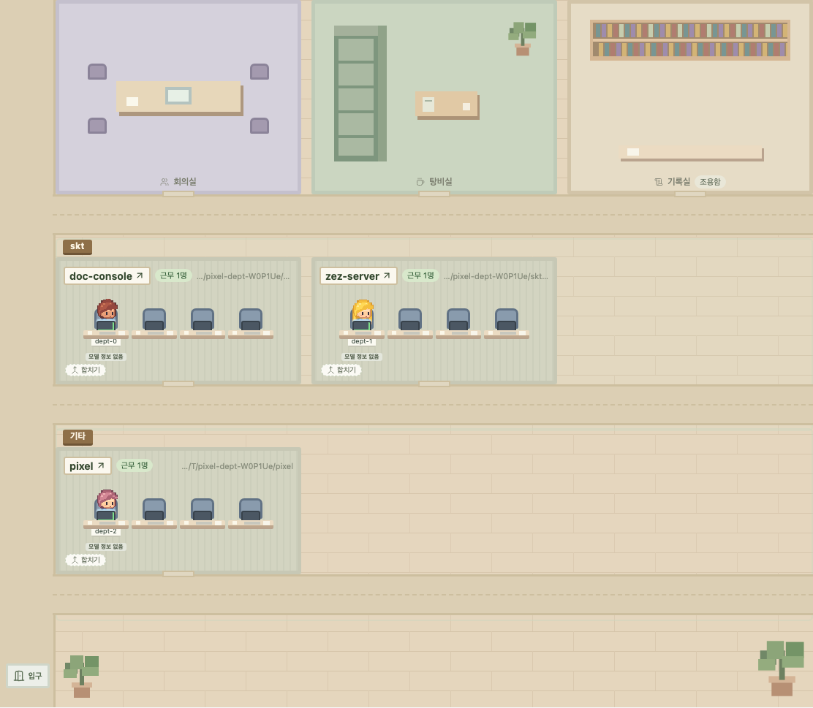
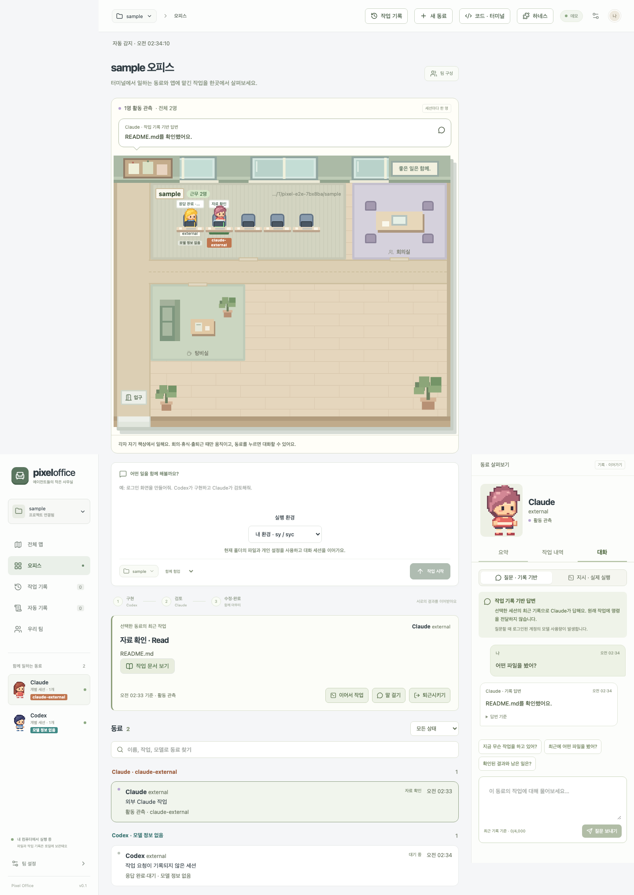
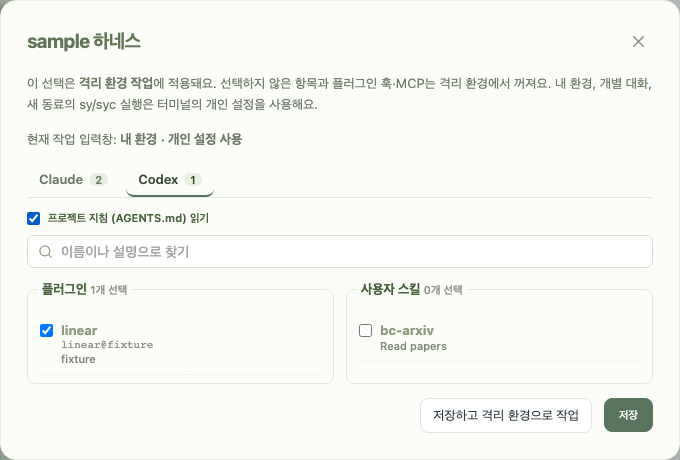
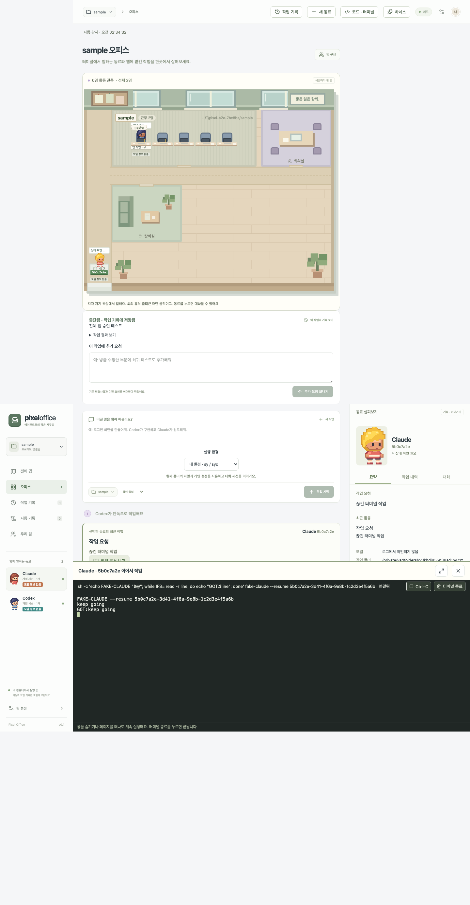
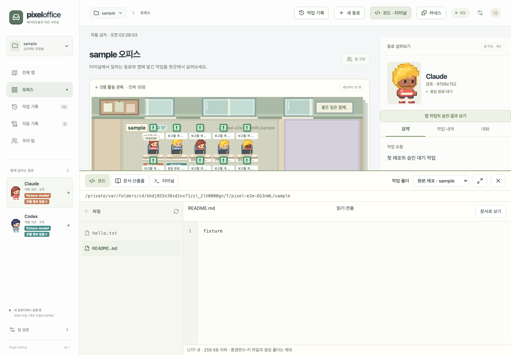
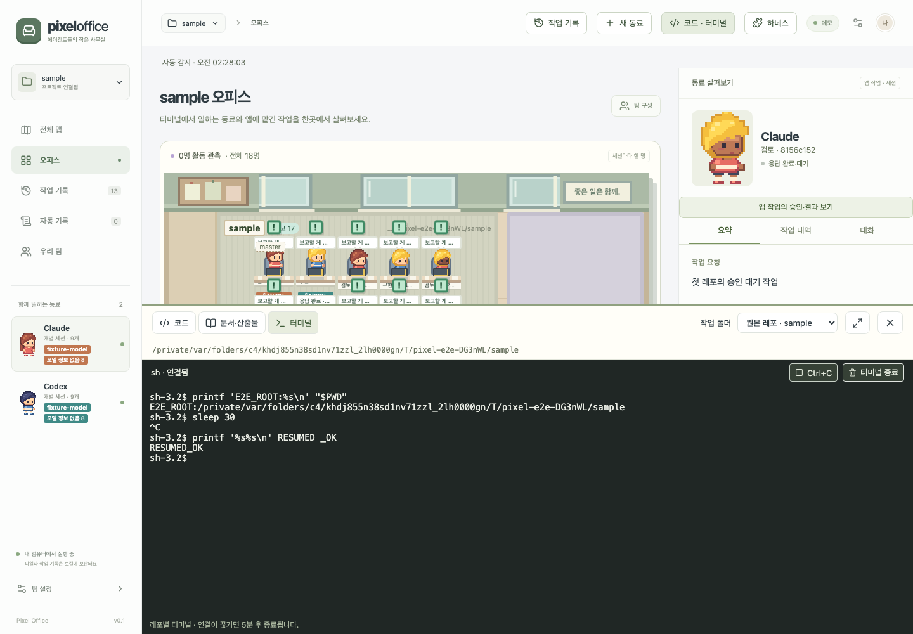
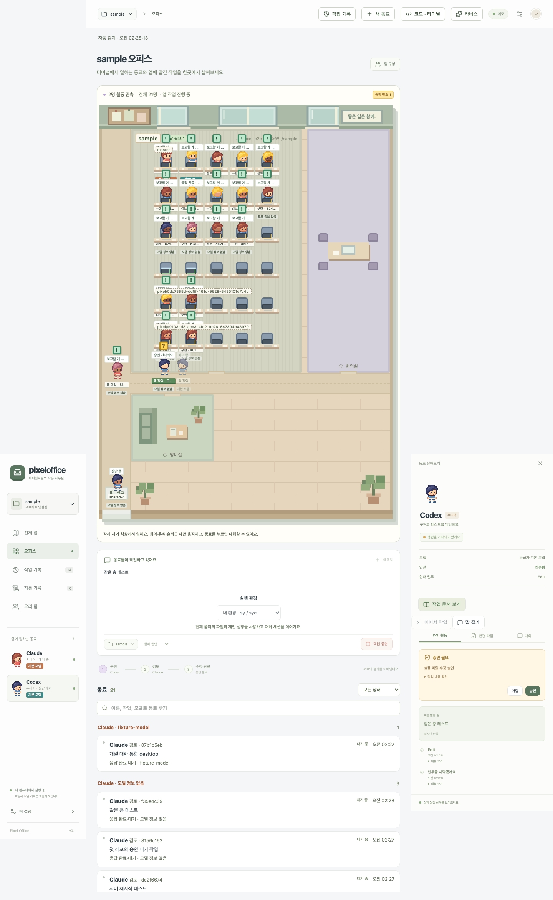
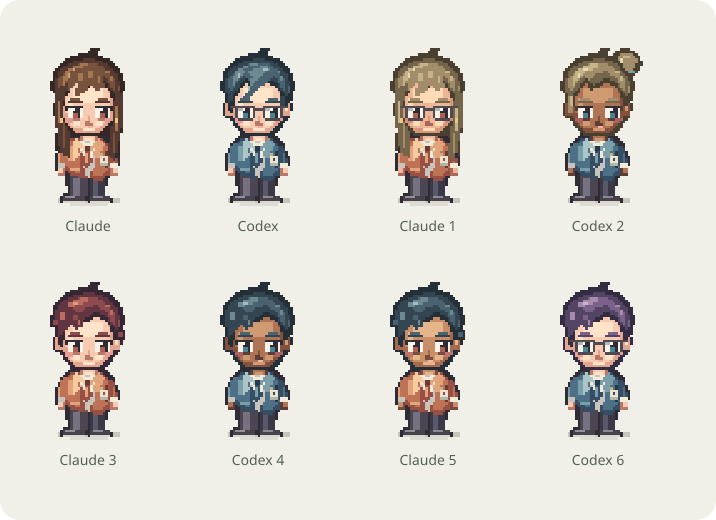

# Pixel Office

Claude Code와 Codex가 함께 일하는 로컬 픽셀 사무실입니다. 프로젝트와 작업을 지정하면 에이전트가 구현·검토·수정을 이어가고, 캐릭터를 선택해 실제 작업 메시지와 변경 파일을 확인할 수 있습니다.



## 시작하기

Node.js **24 이상**, Git, 로그인된 [Codex CLI](https://learn.chatgpt.com/codex)와 [Claude Code](https://code.claude.com/docs/en/overview)가 필요합니다. 현재 검증 환경은 macOS입니다.

```bash
git clone https://github.com/seongyeon1/pixel-office.git
cd pixel-office
npm install
npm run dev
```

터미널에 출력되는 `http://127.0.0.1:4317/#token=...` 연결 URL을 브라우저에서 여세요. 토큰은 앱 연결용이며 공급자 API 키가 아닙니다. 다른 기기에 공유하지 마세요.

프로덕션 빌드로 실행하려면:

```bash
npm run build
npm start
```

## macOS에서 항상 켜두기

터미널 없이 사용하려면 백그라운드 서버와 메뉴바 앱을 한 번 설치하세요.

```bash
npm run desktop:install
```

`~/Applications/Pixel Office.app`이 설치되고 열립니다. 이후 Spotlight에서 **Pixel Office**를 검색하거나 메뉴바 아이콘의 **Pixel Office 열기**를 누르세요. 로그인하면 서버와 메뉴바 앱이 자동 실행됩니다.

- 창의 닫기 버튼은 화면을 숨깁니다. **메뉴바 앱 종료 (서버 유지)** 또는 `⌘Q`로 앱을 종료해도 서버와 앱에서 실행한 작업은 계속됩니다.
- 서버는 macOS `launchd`가 관리합니다. 예기치 않은 종료 후 다시 실행하며, 메뉴바 앱은 새 연결 정보로 자동 재연결합니다. **중단된 에이전트 작업 자체는 자동 재실행하지 않습니다.**
- 앱이 다른 창 뒤에 있거나 숨겨져 있으면 앱 작업의 완료·승인 대기·답변 대기 상태 변경을 알립니다. 외부 Claude/Codex 세션의 완료 알림은 포함하지 않습니다. 알림 표시는 macOS 알림 설정을 따릅니다.
- 메뉴에서 브라우저 열기, 로그 폴더 열기, 로그인 시 **메뉴바 앱** 실행 여부를 선택할 수 있습니다. 이 설정은 서버의 자동 실행과 별개입니다.
- 기존 `.pixel` 기록과 로그인된 CLI를 사용합니다. 이 앱은 **이 컴퓨터의 저장소와 Node 설치를 사용하는 로컬 앱**이므로 저장소 폴더와 Node를 삭제하거나 이동하지 마세요. 다른 컴퓨터에 배포할 독립 설치 패키지나 서명된 앱은 아닙니다.
- 맥이 잠들거나 꺼져 있는 동안에는 작업이 계속되지 않습니다.

웹 화면만 쓰면서 서버를 상주시킬 수도 있습니다.

```bash
npm run service:install    # 빌드 + 백그라운드 서버 설치 및 시작
npm run service:open       # 현재 연결 정보로 브라우저 열기
npm run service:status     # 설치·실행·연결 상태 확인
npm run service:stop       # 서버 중지 + 서버의 로그인 자동 실행 해제
npm run service:start      # 서버 시작 + 로그인 자동 실행 복원
npm run service:uninstall  # 서비스 제거, 작업 기록과 로그 보존
```

서버 중지·제거는 진행 중인 앱 작업과 앱 터미널도 종료합니다. 로그인 시 메뉴바 앱이 자동으로 열려도 명시적으로 중지한 서버는 그대로 중지 상태를 유지합니다. 앱을 직접 다시 실행하거나 메뉴의 **서버 시작**을 선택하면 설치된 서버가 시작됩니다.

서버가 4317 포트를 사용하는 동안 `npm run dev`나 `npm start`를 함께 실행하지 마세요. 기존 개발 서버가 실행 중이면 해당 터미널에서 종료한 뒤 설치하세요. 다른 포트가 필요하면 설치 시 `PORT=4320 npm run desktop:install`을 사용합니다.

코드를 업데이트할 때는 진행 중인 작업을 마무리한 뒤 `npm run service:stop` → `npm run desktop:install` 순서로 실행하세요. 저장소를 옮겼다면 새 위치에서 같은 순서로 다시 설치합니다. 앱 제거는 메뉴바 앱의 로그인 실행을 끄고 종료한 뒤 `npm run service:uninstall`을 실행하고 `~/Applications/Pixel Office.app`을 휴지통으로 옮기면 됩니다.

서비스 설정은 `~/Library/Application Support/Pixel Office/service.json`, 로그는 `~/Library/Logs/Pixel Office/`에 있습니다. CLI 검색 경로와 `CODEX_HOME`·`CLAUDE_CONFIG_DIR`은 설치 시 저장됩니다. 셸의 모든 환경 변수나 API 키를 복사하지 않으므로, 셸에서만 설정한 공급자 옵션은 별도로 설정해야 합니다. Node 버전이나 CLI 경로가 바뀌면 서비스를 중지한 뒤 다시 설치하세요.

개발 중 메뉴바 앱만 열려면 `npm run build` 후 `npm run desktop`을 실행합니다. 앱 번들 생성만 하려면 `npm run desktop:package`, 데스크톱 동작 검증은 빌드 후 `npm run test:desktop`을 사용합니다.

설치된 앱까지 검증하려면 `PIXEL_DESKTOP_EXECUTABLE="$HOME/Applications/Pixel Office.app/Contents/MacOS/Pixel Office" npm run test:desktop`을 실행하세요. 별도의 테스트 서버와 브라우저 프로필을 사용합니다.

공급자 로그인이 필요하면 각각의 공식 CLI에서 로그인하세요.

```bash
codex login
claude auth login
```

CLI 설치·로그인 상태와 실제 작업 성공은 별개입니다. 선택 모델의 계정 접근 권한이나 실행 한도에 문제가 있으면 화면에 해당 오류가 표시됩니다. 실제 실행에는 각 공급자의 구독 또는 API 사용 정책이 적용됩니다.

## 사용 흐름

1. **프로젝트 연결**에서 최초 커밋이 있는 Git 프로젝트의 절대 경로를 입력합니다.
2. **팀 구성**에서 각 에이전트의 모델과 시니어·주니어·신입 페르소나를 설정합니다. 모델 목록을 불러오며 직접 식별자를 입력할 수도 있습니다. 비워두면 공급자 기본 모델을 사용합니다.
3. 작업 내용을 입력하고 협업 또는 단독 실행을 선택합니다.
4. **작업 시작**을 누릅니다. 협업은 기본적으로 Codex 구현 → Claude 검토 → 필요시 수정 순서이며 역할을 바꿀 수 있습니다.
5. 캐릭터 또는 동료 목록을 선택해 메시지·도구 실행·변경 파일을 봅니다. 승인이나 질문이 필요하면 상세 패널에서 응답합니다.
6. 완료 후 작업 결과, 별도 작업 폴더, 브랜치를 확인합니다. 실행 도중에는 **작업 중단**을 사용할 수 있습니다.

직급별 작업 지침은 **격리 환경**에서만 적용합니다. 기본 **내 환경**에서는 직급으로 행동을 제한하지 않습니다. 직급은 실제 연차나 성능 순위가 아닌 작업 지침입니다. 시니어는 구조·위험·판단 근거, 주니어는 구현·테스트, 신입은 작은 작업과 질문·검토 요청에 집중합니다. 직급을 바꾸어도 실행 권한은 확대되지 않습니다.

### 실행 환경

기본값 **내 환경 · sy / syc**는 터미널의 개인 실행 명령을 사용합니다. 사용자·프로젝트 지침, 플러그인, 훅과 기본 모델 설정을 유지하며, 선택한 원본 폴더의 현재 파일(미커밋 변경 포함)에서 작업합니다. 구현과 검토의 세션은 각각 저장하고 추가 요청에서 재개합니다. 팀에서 모델을 지정하면 해당 모델이 우선합니다.

**격리 환경 · 선택한 설정만**은 별도 worktree에서 선택한 하네스만 사용합니다. 아래 하네스 선택은 이 모드에 적용됩니다. 기존 기록의 추가 요청은 기존 작업 폴더를 유지하며 개인 환경으로 전환하고, 이전 요약을 전달해 새 개인 세션을 시작합니다.

### 도구 승인 방식

**팀 구성** 또는 **우리 팀 → 도구 승인 방식**에서 **매번 확인 / 자동 승인**을 선택합니다. 기본값은 매번 확인이며, 변경한 설정은 서버에 저장되어 앱을 다시 열어도 유지됩니다. 이 설정은 앱 전체 프로젝트에 적용됩니다.

- **내 환경·개별 대화 + 자동 승인**은 터미널의 `sy` / `syc`와 같이 공급자의 권한 확인과 샌드박스 제한을 해제합니다. 이 실행 정책은 다음 구현·검토 단계부터 적용되므로 실행 중 정책을 바꾸려면 중단 후 추가 요청으로 재개하세요.
- **격리 환경**에서는 앱에 도착한 도구 승인을 자동으로 처리하며 승인 내역을 기록합니다. 대기 중인 승인에도 설정이 즉시 적용됩니다.
- 답변이 필요한 **질문은 직접 응답**해야 합니다. 격리 환경의 추가 권한 요청도 직접 응답해야 합니다. 자동 승인을 꺼도 이미 허용되어 실행 중인 명령을 되돌리지는 않으며, 이후 요청부터 다시 확인합니다.
- 격리 환경에서는 기존 작업 폴더·검토자 제한을 유지하며, Codex의 추가 권한 부여는 자동 승인하지 않습니다. 외부 터미널과 앱의 이어가기 터미널은 해당 CLI의 승인 설정을 사용합니다.

동료 목록, 상세 패널, 팀 설정은 오피스와 같은 픽셀 캐릭터를 표시합니다.

## 작업 기록과 추가 요청

상단 **작업 기록**에서 모든 프로젝트의 최근 작업을 확인합니다. **기록 범위 → 현재 프로젝트**로 좁히면 해당 저장소가 포함된 묶음 작업도 표시됩니다. 기록을 누르면 그 작업의 프로젝트와 결과가 열립니다. 각 범위에서 최근 100개를 보여줍니다.

완료·중단된 작업 위의 **이 작업에 추가 요청**에 내용을 적어 보내면 기존 작업 폴더와 변경 파일, 팀 설정을 유지하며 이어서 작업합니다. 이전 요청과 결과도 전달되며, 추가 요청마다 별도 기록이 저장되어 원래 요청과 결과는 덮어쓰지 않습니다. 변경 파일 화면은 공유하는 작업 폴더의 현재 상태를 보여줍니다. 진행 중인 작업이 있으면 완료하거나 중단한 뒤 보낼 수 있고, 기존 작업 폴더가 사라졌다면 새 작업으로 시작해야 합니다.

## 레포별로 보기

상단 **레포 전환** 버튼이나 왼쪽 프로젝트 이름을 누르면 연결된 레포 목록이 열립니다. 각 레포의 전체 경로, 최근 상태, 누적 작업 수를 확인하고 전환할 수 있습니다.

- 레포를 선택하면 해당 레포의 최근 작업과 오피스를 불러오고, 메시지·변경 파일을 분리해 보여줍니다.
- 새 레포는 목록 아래에서 Git 프로젝트 경로로 연결합니다. 레포 목록은 서버에, 마지막 선택은 브라우저에 저장됩니다.
- 기존 실행 기록이 있는 레포도 자동으로 목록에 포함됩니다. 이름이 같아도 전체 경로가 다르면 별도 레포입니다.
- 다른 레포에서 작업 중이면 상태와 **작업 보러 가기** 버튼을 표시합니다. 화면 전환은 실행 중인 작업을 중단하지 않습니다.
- 작업 기록은 선택한 레포의 최근 100개를 표시합니다. 레포 목록의 작업 수는 전체 누적 수입니다.
- 삭제되거나 이동한 레포도 보관된 기록을 열 수 있습니다. 새 작업을 시작하려면 유효한 경로가 필요합니다.

앱에서 시작하는 작업은 전체에서 한 개씩 진행합니다. 외부 세션 관측은 여러 레포·세션을 동시에 표시합니다.

## 여러 프로젝트를 한 맵에서 보기

왼쪽 **전체 맵**을 누르면 모든 프로젝트가 한 층짜리 사무실로 표시됩니다. 레포마다 방이 하나씩 있고, 회의실·탕비실·입구는 복도와 왼쪽 통로로 이어집니다. 프로젝트를 전환하지 않고 여러 곳의 활동을 함께 볼 수 있습니다.



- **방 = 레포, 책상 줄 = 워크트리.** 같은 레포의 여러 워크트리에서 일하는 세션은 같은 방에 앉고, 워크트리마다 브랜치 이름표가 붙습니다. 작업이 끝나 지운 워크트리의 세션도 원래 레포 방에 남습니다.
- **출근과 퇴근.** 새로 감지된 세션은 입구로 들어와 자기 자리에 앉습니다. Claude 터미널이 닫히면 바로 입구로 걸어 나가 **최근 퇴근** 목록으로 옮겨집니다. 터미널이 열려 있으면 오래 조용해도 자리에 남고, 30분이 넘으면 흐리게 **자리 비움 · 마지막 활동 시각**으로 표시됩니다. 프로세스 상태를 알 수 없는 Codex는 마지막 활동 뒤 30분이 지나면 퇴근합니다. 사람의 답을 기다리는 동료는 퇴근하지 않습니다.
- **머리 위 표시.** `?`는 질문(`AskUserQuestion`, Codex 입력 요청)이나 계획 승인(`ExitPlanMode`)을 기다리는 상태입니다. 점선 `?`는 도구가 1분 넘게 결과 없이 멈춰 있어 권한 승인을 기다리는 것으로 추정되는 상태입니다. `!`는 작업을 끝내고 보고가 있는 상태이며, 캐릭터를 눌러 열면 사라집니다.
- **협업 동선.** subagent는 자기를 띄운 세션 옆자리에서 일하다 끝나면 퇴근합니다. 앱 협업 작업의 리뷰 단계에서는 구현 담당이 리뷰어 옆으로 갑니다. 같은 레포에서 여러 명이 동시에 일하면 가끔 회의실에 모이고, 한가한 동료는 가끔 탕비실에 들릅니다.
- **부서.** 맵 위 **부서 관리**에서 이름과 폴더로 부서를 만들면, 그 폴더 안의 저장소 방이 층의 같은 구역(이름판과 옅은 바닥색)에 모입니다. 여러 부서에 걸리면 가장 깊은 폴더를 따르고, 어디에도 없는 방은 **기타**입니다. 검색 줄의 부서 선택으로 한 부서만 볼 수 있습니다.



- **방 묶기.** 같은 저장소의 워크트리는 한 방에 모이고, 방 이름 옆에 원격 저장소 이름(`origin`)이 붙습니다. 지워진 워크트리도 저장소의 워크트리 기록이 남아 있으면 원래 방으로 돌아갑니다. git이 아닌 폴더의 하위 폴더는 바깥 폴더 방으로 모이고(홈 폴더는 제외), 자동 세션만 있는 경로는 방을 만들지 않습니다. 그래도 갈라진 방은 방 왼쪽 아래 **합치기**로 다른 방에 합치고, 합쳐진 폴더 칩의 ✕로 분리합니다. 합치기는 보이는 묶음만 바꾸고 작업 폴더·파일 접근 범위는 그대로입니다.
- **모델 계열.** 캐릭터 이름표 아래에 모델 계열 배지(Claude: Fable·Opus·Sonnet·Haiku, Codex: Astra·Sol·Terra·Luna)가 붙고, 마우스를 올리면 공급자 카탈로그의 모델 설명이 보입니다. 검색 줄의 모델 선택으로 한 계열만 남길 수 있고, 사이드바와 오피스 동료 목록도 계열별로 묶입니다. 계열 순서는 보기 위한 순서일 뿐 직급·권한·작업 배치를 바꾸지 않습니다.
- 방마다 책상 줄은 최대 3개까지 보여 주고, 넘치는 인원은 **+N명 더 보기**로 표시합니다. 캐릭터를 누르면 해당 프로젝트와 세션을 바로 선택하고, 프로젝트 이름을 누르면 해당 오피스가 열립니다.
- 이름·경로 검색과 **활동 있는 프로젝트만** 필터를 지원합니다. 전체 맵을 보고 새로고침해도 같은 화면으로 돌아옵니다.
- 코드와 터미널은 프로젝트 오피스에 들어간 뒤 열 수 있습니다.

## 이미 실행 중인 세션 보기

앱을 켜면 이 컴퓨터의 Claude Code·Codex 로그를 자동으로 탐색합니다. 레포를 고르면 그 레포의 **오피스**에서 이미 진행 중인 작업과 앱에 맡긴 작업을 한 층에서 함께 확인합니다. 같은 레포에서 여러 세션이 발견되면 목록에서 하나를 선택할 수 있습니다.

- 읽기·수정·명령 실행, 최근 메시지, 모델, 실제 작업 폴더를 표시합니다. 새 파일 발견은 약 10초, 활동 반영은 약 2~4초 간격입니다.
- Git worktree 세션은 원래 저장소로 묶고, 각 세션의 작업 폴더도 표시합니다.
- **활동 관측**은 최근 로그 기준입니다. **응답 완료·대기**는 한 응답이 끝난 상태, **상태 확인 필요**는 2분 이상 새 활동을 확인하지 못한 상태입니다.
- 외부 세션의 기록을 읽어 표시합니다. **이어서 작업**으로 CLI 대화를 재개할 수 있으며, 원래 실행 중인 프로세스의 터미널을 가져오는 방식은 아닙니다.
- 최근 7일의 로그와 열린 세션 후보 중 최대 200개를 읽습니다. Claude 세션 레지스트리와 Codex writer-lock 후보를 우선 포함합니다.
- 기본 위치는 `~/.codex/sessions`와 `~/.claude/projects`입니다. `CODEX_HOME`과 `CLAUDE_CONFIG_DIR`로 변경된 위치도 지원합니다.
- 로컬 로그를 남기지 않는 세션이나 다른 컴퓨터·컨테이너 안의 세션은 감지하지 못할 수 있습니다.

상태 해석과 저장 범위는 [외부 세션 관측](docs/external-sessions.md)에 정리했습니다.

## 동료에게 질문하기



오피스에서 캐릭터나 동료 목록을 선택하세요. 같은 Codex·Claude도 실행 세션마다 별도 캐릭터로 표시합니다.

- **요약**: 작업 요청, 최근 활동, 모델과 작업 폴더를 확인합니다.
- **작업 내역**: 시간순 기록을 읽고 필요한 도구 실행 내용을 펼칩니다. 긴 실행 코드는 기본적으로 접습니다.
- **대화**: 질문을 입력하거나 빠른 질문을 누릅니다. 답변은 캐릭터의 말풍선과 대화 패널에 함께 표시됩니다.
- 이름·작업·모델 검색과 상태 필터로 동료를 찾습니다. 오피스는 페이지당 최대 8명을 표시합니다.
- 질문과 답변은 세션별로 SQLite에 보관하며 최근 100개 메시지를 표시합니다. 새로고침·서버 재시작 후에도 남습니다. **답변 중단**은 별도 답변 생성만 취소합니다.

**작업 기록 기반 답변**은 선택한 세션의 최근 최대 24개 이벤트와 해당 대화 일부를 같은 공급자의 별도 요청에 전달합니다. 원래 실행 중인 에이전트에 직접 질문을 보내거나 작업을 지시하는 기능은 아닙니다. 관측되지 않은 파일·테스트 결과는 확인할 수 없습니다.

질문 시 기존 CLI 로그인과 공급자 기본 모델을 사용하며 모델 사용량이 발생합니다. 원본 작업 모델과 답변 모델은 다를 수 있고, 답변 아래 **답변 기준**에서 실제 모델과 기록 시각을 확인할 수 있습니다. 앱 내부 작업의 승인·질문 응답 화면은 기존대로 유지합니다.

## 터미널 Claude의 질문에 답하기

터미널에서 실행 중인 Claude가 선택지 질문(AskUserQuestion)을 하면 오피스에서 바로 답할 수 있어요. **팀 구성 → 터미널 질문 연결 켜기**를 누르면 `~/.claude/settings.json`(또는 `CLAUDE_CONFIG_DIR`)에 `PreToolUse` 훅 하나를 추가합니다. 바꾸기 전에 원래 파일을 `settings.json.pixel-backup-<시각>`으로 백업하고, **끄기**는 이 앱이 추가한 항목만 지웁니다.

- 질문이 오면 해당 동료를 선택했을 때 패널 맨 위에 선택지 폼이 나옵니다. 답을 보내면 터미널의 Claude가 그 답으로 이어서 작업합니다.
- **터미널에서 답할게요**를 누르거나, 앱이 꺼져 있거나, 약 10분 안에 답하지 않으면 터미널에서 평소처럼 질문을 표시합니다.
- 훅은 `.pixel/hook.json`(권한 600)의 전용 토큰으로만 질문을 올릴 수 있고, 답은 브라우저 연결 세션에서만 보낼 수 있습니다.
- 이미 열려 있던 터미널은 다시 시작해야 훅이 적용될 수 있습니다. 훅이 없는 상태에서 질문 대기 중인 동료를 선택하면 연결 안내가 나옵니다.

## 자동 기록(업무일지·세션 요약·메모리 정리)

훅이나 스크립트가 `claude -p`·SDK·`codex exec`로 띄운 세션(업무일지, 세션 요약, 요약 종합, 지식 추출, memory-lake 정리 등)은 사람이 연 세션과 따로 다룹니다. Claude 기록의 `entrypoint: sdk-cli`, Codex의 `source: exec`로 구분합니다.

- 레포 방·오피스·동료 목록·근무 인원·`!` 보고에 나타나지 않습니다. 지금 작성 중인 자동 작업만 층의 **기록실**에 앉습니다.
- 사이드바 **자동 기록**에서 날짜·레포·종류별로 모아 보고, 펼치면 결과 본문(예: 그날의 업무일지)을 읽을 수 있습니다.
- 관측 상한(최근 200개)은 사람 세션부터 채우고, 이미 자동으로 판정된 기록은 뒤로 밀립니다.

## 동료별 대화와 시작 설정

앱 작업의 구현·검토 동료와 터미널에서 시작한 동료는 같은 세션 목록에서 **말 걸기**, **이어서 작업**, 대화 기록을 사용합니다. 앱 작업 상세의 **대화** 탭에서도 선택한 동료에게 개별 요청을 보낼 수 있습니다. 작업이 진행 중이면 해당 작업의 추가 대화는 완료 또는 중단 후 시작하며, 개별 대화나 연결된 터미널이 열려 있으면 같은 폴더의 앱 작업을 동시에 시작하지 않습니다.

개별 요청은 개인 `sy` / `syc` 설정으로 원본 세션을 재개합니다. 이전 버전의 임시 세션처럼 원본을 재개할 수 없는 기록은 화면에 안내하고, 저장된 작업 내용을 전달해 새 대화를 시작합니다. 새로고침하거나 앱을 다시 열어도 동료별 대화가 유지됩니다.

**내 하네스로 동료 시작**에서 작업 폴더와 모델을 선택하세요. 연결된 폴더를 고르거나 새 절대 경로를 입력할 수 있고, 모델을 비우면 개인 기본값을 사용합니다. 시작하면 창이 닫히고 선택한 폴더의 동료로 이동합니다. 해당 동료의 **이어서 작업**은 이미 실행 중인 터미널을 다시 엽니다.

**실행 하네스**는 Claude Code나 Codex를 감싸 실행하는 명령입니다. 기본 목록은 `claude`, `codex`와 설치돼 있을 때의 `sy`, `syc`이고, **하네스 추가 · 삭제**에서 자신의 래퍼 명령을 공급자별로 등록할 수 있습니다. 공백 없는 실행 파일 이름만 받으며, 등록한 명령으로 시작한 동료는 이어서 작업할 때도 같은 명령을 씁니다. PATH에서 찾을 수 없는 명령은 **설치 안 됨**으로 표시합니다.

## 레포별 하네스(플러그인·스킬)

상단의 **하네스**에서 이 레포의 **격리 환경 작업**에 쓸 플러그인과 사용자 스킬, 프로젝트 지침(CLAUDE.md / AGENTS.md) 읽기를 공급자별로 고릅니다. 고르지 않은 것은 모두 꺼진 채로 실행됩니다. 앱 작업을 만들 때의 설정이 작업 기록에 함께 저장되고, 진행 중에 설정을 바꿔도 그 작업에는 영향이 없습니다.

하네스 창의 **저장하고 격리 환경으로 작업**을 누르면 저장과 실행 환경 전환이 함께 적용됩니다. **내 환경**, 개별 대화, **내 하네스로 동료 시작**은 개인 CLI 설정을 사용하므로 이 선택 목록으로 개인 플러그인을 끄거나 켜지 않습니다.



- Claude는 격리 실행(`settingSources: []`)을 유지하고, 고른 플러그인을 훅·MCP 서버를 뺀 사본으로, 고른 사용자 스킬을 레포 전용 플러그인으로 넘깁니다.
- Codex는 스레드 설정으로 고르지 않은 플러그인과 스킬, 훅을 끄고, 프로젝트 지침을 고르지 않으면 AGENTS.md도 읽지 않습니다. 내 환경에서는 이 제한 없이 개인 설정을 그대로 불러옵니다.
- 기록 기반 답변 대화는 계속 플러그인·스킬 없이 동작하고, 이어가기 터미널은 CLI 기본 설정을 그대로 씁니다.

## 원래 세션 이어가기와 퇴근

캐릭터를 누르고 최근 작업 카드의 **이어서 작업**을 선택하세요. 하단 터미널에서 **이어서 작업**을 누르면 Claude는 `claude --resume <세션 ID>`, Codex는 `codex resume <세션 ID>`로 원래 대화를 불러옵니다. 여기서 입력한 내용은 실제 에이전트에 전달되며, 명령 승인과 중단도 터미널에서 진행합니다. **대화** 탭의 기록 기반 질문과는 별도 기능입니다.

- 원래 프로세스가 살아 있거나 최근 활동 중이면 중복 재개를 막습니다. 원래 작업을 종료한 뒤 재개하거나 **복제해서 이어가기**로 대화 기록을 가진 새 세션을 여세요. 복제는 대화만 복제하며 파일 작업 폴더는 공유합니다.
- 원래 `cwd`에서 실행하므로 worktree 세션도 같은 폴더를 사용합니다. 폴더가 삭제됐다면 먼저 복구해야 합니다. 임의의 원본 레포로 바꾸어 실행하지 않습니다.
- 같은 세션을 여러 번 눌러도 앱에서는 하나의 터미널에 다시 연결합니다. 창 숨기기·프로젝트 전환·새로고침 후에도 살아 있으며, 명시적으로 종료하거나 앱 서버가 종료될 때 끝납니다. 일반 레포 셸과 합쳐 최대 8개를 지원합니다.
- **퇴근시키기 → 퇴근 확인**은 맵과 활성 동료 목록에서 숨기고, 앱에서 연 해당 이어가기 터미널과 기록 답변 생성을 종료합니다. 원본 로그·작업 파일·worktree는 삭제하지 않습니다. 다른 터미널·IDE에서 실행 중인 원래 프로세스는 중단하지 않습니다.
- 전체 맵이나 오피스 아래 **직접 퇴근시킨 동료**를 펼쳐 **다시 출근**할 수 있습니다. 퇴근 상태는 서버 재시작 후에도 유지됩니다. 원본 로그가 관측 범위를 벗어났다면 원래 CLI에서 세션을 열어 다시 감지시켜 주세요.



로컬 CLI 설치와 로그인이 필요하며, 이어서 보낸 작업은 공급자 모델 사용량을 발생시킵니다. 기존 CLI의 승인·샌드박스 설정을 사용합니다.

## 오피스 안에서 코드·문서·터미널 사용하기

상단 **코드 · 터미널**을 누르면 하단 작업 공간이 열립니다. 확대 버튼으로 더 넓게 볼 수 있습니다.

- **코드**: 폴더와 파일을 선택해 줄 번호가 있는 읽기 전용 미리보기를 엽니다. 새로고침 버튼으로 에이전트가 수정한 내용을 다시 읽습니다. UTF-8 텍스트 256 KB 이하를 지원하며, 심볼릭 링크·환경변수·키 파일과 `.git`, `.pixel`, `node_modules`, `dist`, `.next`는 제외합니다. 디렉터리마다 최대 500개 항목을 표시합니다.
- **작업 문서 보기**: 선택한 동료의 최근 작업 카드, 앱 작업 상세, 작업 기록에서 바로 여세요. 작업과 연결된 Markdown만 모아 첫 문서를 자동으로 펼칩니다. 외부 세션은 최근 요청의 작성 도구 기록과 답변 링크를 사용하며, **이 세션 전체**를 선택하면 이전 요청의 문서도 볼 수 있습니다. 로그에 경로가 없는 문서는 자동으로 연결하지 않으며, 문서는 현재 파일 내용을 보여줍니다.
- **문서·산출물**: Markdown 문서를 제목·표·체크 목록·이미지·Mermaid 다이어그램으로 읽습니다. **미리보기 / 원문 / 변경 비교**를 전환하고, 문서 안의 상대 경로 링크로 다른 Markdown을 열 수 있습니다. 작업 결과와 변경 파일의 **문서 열기**는 해당 실행의 작업 폴더로 이동합니다. 자동 갱신은 문서 탭이 보이는 동안 약 3초마다 파일을 다시 읽으며 끌 수 있습니다. 로컬 이미지는 PNG/JPEG/GIF/WebP 5 MB 이하를 지원합니다. 문서의 HTML은 실행하지 않으며, 잘못된 다이어그램은 원문을 보여줍니다.
- **작업 폴더**: 원본 레포와 선택한 앱 실행의 별도 worktree를 구분합니다. 에이전트가 변경한 코드를 보려면 **앱 작업 폴더**를 선택하세요.
- **터미널**: **터미널 시작**을 누르면 선택한 폴더에서 실제 로컬 셸을 엽니다. 명령 입력, 대화형 프로그램, `Ctrl+C`, 화면 크기 변경을 지원합니다. 명령은 로컬 사용자 권한으로 실행되며 실제 파일을 변경할 수 있습니다. 파일 미리보기의 경로 제한은 셸 샌드박스를 의미하지 않습니다.
- 패널을 닫거나 레포를 바꿔도 터미널은 남습니다. 같은 브라우저 탭에서 5분 안에 돌아오면 출력과 현재 셸에 다시 연결합니다. 네트워크가 끊기면 **다시 연결**, 완전히 닫으려면 **터미널 종료**를 사용합니다. 연결이 없는 터미널은 5분 뒤 정리하며 서버 종료 시에도 종료합니다.
- 최대 8개 터미널을 지원하고, 재연결 시 최근 출력 약 256K 문자를 재생합니다. 원래 Claude/Codex 실행 세션에 입력하는 기능이 아니라 사용자가 여는 별도의 셸입니다. 이 셸에서 CLI를 직접 실행할 수도 있습니다.




터미널 UI는 [xterm.js](https://xtermjs.org/docs/), 실제 셸 연결은 [node-pty](https://github.com/microsoft/node-pty)를 사용합니다. 현재 셸 실행은 macOS/Linux를 대상으로 하며, macOS prebuilt 보조 실행 파일의 권한은 설치 스크립트가 보정합니다. 네이티브 바이너리가 없는 플랫폼에서 설치하려면 Python과 C/C++ 빌드 도구가 필요할 수 있습니다.

## 맵에서 움직이는 동료

레포 오피스는 전체 맵의 방 하나를 크게 보여 줍니다. 레포 방 옆에 회의실과 탕비실이 있고, 동료는 워크트리별 책상 줄에서 **자기 자리를 지킵니다.** 코드 작성·자료 확인·명령 실행 같은 작업 종류는 자리 이동이 아니라 머리 위 말풍선으로 보여 줍니다. 명령을 실행 중이라는 표시만으로 테스트 성공을 의미하지는 않습니다.

동료가 움직이는 때는 전체 맵과 같습니다. 출근·퇴근할 때, subagent가 부모 옆자리로 올 때, 같은 레포에서 여러 명이 일해 가끔 회의실에 모일 때, 한가한 동료가 탕비실에 들를 때입니다. 오피스에서는 인원만큼 책상 줄을 늘리므로 페이지를 넘기지 않습니다. 퇴근한 동료는 방에서 빠지고 아래 동료 목록에서 볼 수 있습니다. 이동 중에도 캐릭터를 눌러 작업 내역과 대화를 열 수 있으며, OS의 이동 줄이기 설정을 따릅니다.

## 한 화면의 레포 오피스

레포 오피스는 한 화면입니다. 터미널·IDE에서 일하는 외부 세션 동료와, 앱에 맡긴 작업(구현·검토)의 동료가 같은 방에 앉습니다. 앱 작업 동료는 실행 중인 원본 폴더 또는 `pixel/<작업 ID>` 워크트리 줄에 앉고, 승인이나 질문이 오면 머리 위에 `?`가 뜹니다. 동료별 대화와 이어가기 기능을 공통으로 사용하며, 진행 중인 앱 작업은 승인·결과 화면으로 연결됩니다.



- **모든 동료:** 요약·작업 내역·기록 기반 질문·말 걸기·이어서 작업·퇴근을 제공합니다. 동료별 요청과 답변은 각각 보관됩니다.
- **앱 작업 동료:** 승인·질문 답변, 변경 파일, 실행 결과와 중단 기능도 제공합니다. 구현자와 검토자에게 따로 대화할 수 있습니다.
- 팀의 직급·모델은 **팀 구성**에서 정합니다. 외부에서 실행 중인 프로세스의 승인·중단은 해당 터미널에서 처리하며, 질문 연결이 설정된 Claude 질문은 앱에서도 답할 수 있습니다.

## 픽셀 캐릭터



32×40 픽셀의 큰 머리와 작은 몸, 점눈과 볼터치로 귀여운 캐릭터를 표현합니다. 헤어스타일 4종과 머리색·피부색·티셔츠·원피스 조합은 세션 ID로 정해져 새로고침 후에도 유지됩니다. Claude는 코랄색, Codex는 파란색 옷으로 구분합니다. 오피스와 상세 패널은 같은 픽셀 원본을 사용합니다.

## 프로젝트와 기록

- 한 번에 한 작업을 실행하며 두 에이전트는 같은 worktree를 순서대로 사용합니다.
- **격리 환경**은 원본 프로젝트의 마지막 커밋에서 `pixel/<실행 ID>` 브랜치와 별도 worktree를 만듭니다. **커밋되지 않은 원본 변경은 작업에 포함되지 않습니다.**
- PR 생성·커밋·푸시를 명시적으로 요청하면 에이전트가 수행합니다. GitHub PR 요청은 열린 PR의 URL과 현재 커밋, 미커밋 변경 유무를 확인해야 완료가 됩니다. 확인하지 못하면 **확인 필요**로 남고 이유를 표시합니다. 병합·배포는 별도 요청이 필요합니다.
- 작업 폴더는 `.pixel/workspaces/`, 실행 기록은 `.pixel/office.sqlite`에 보관합니다. 결과 파일은 실패·중단 후에도 보존합니다.
- 브라우저를 새로고침해도 서버에서 작업은 계속됩니다. 서버 재시작 후 진행 중이던 작업은 중단된 기록으로 남으며 자동 재실행하지 않습니다.
- 검토 후 수정은 최대 2회입니다. 해결되지 않은 지적이나 검증 불가능한 결과는 **확인 필요**로 표시됩니다.

격리 환경에서 완료된 결과를 원본에 반영하려면 화면에 표시된 **작업 폴더**에서 변경 내용을 검토하고 커밋한 뒤, 원본 저장소에서 해당 작업 브랜치를 병합하세요. 원본에 미커밋 변경이 있다면 먼저 정리해야 합니다. **작업 기록 → 작업 폴더 정리**에서 앱이 만든 워크트리를 직접 삭제할 수 있습니다. 원본 저장소·Git 브랜치·작업 기록은 보존하며, 사용 중인 작업이나 터미널이 있으면 정리를 막습니다. 미커밋·추적되지 않은 파일·무시된 파일은 목록에서 확인하고 별도 삭제 동의가 필요합니다. 정리한 폴더의 기록은 계속 볼 수 있지만 추가 요청·개별 지시는 새 작업으로 시작해야 합니다. 앱은 워크트리를 자동 삭제하지 않습니다.

## 로컬 실행 설정

| 환경 변수        | 기본값   | 용도                            |
| ---------------- | -------- | ------------------------------- |
| `PORT`           | `4317`   | 로컬 서버 포트                  |
| `PIXEL_DATA_DIR` | `.pixel` | 실행 기록과 작업 폴더 저장 경로 |

서버는 `127.0.0.1`에만 연결합니다. 실행 제어 API는 연결 세션과 동일 출처 검사를 요구합니다. 도구 승인은 선택한 승인 방식에 따르며, 공급자 샌드박스는 격리 환경에서 유지합니다. **검토 에이전트는 소스를 수정하지 않는 역할**이며 검증 도구가 쓰기 권한을 요구하면 실행에 제한이 있을 수 있습니다.

## 검증

```bash
npm test
npm run typecheck
npm run build
npx playwright install chromium
npm run test:e2e
```

브라우저 테스트는 별도 샘플 Git 저장소와 **데모** 공급자를 사용해 승인·질문·중단·복구 흐름을 재현합니다. 실제 계정 실행 검증은 별도 명령입니다.

```bash
npm run smoke -- --provider codex
npm run smoke -- --provider claude
npm run smoke -- --collaborate
npx tsx scripts/chat-smoke.ts # 실제 Claude·Codex 기록 질문 검증 (모델 사용량 발생)
```

Smoke 검증은 임시 샘플 저장소에서만 작은 덧셈 함수를 구현·검토합니다. 알려진 샘플 파일 수정과 제한된 검증 명령만 테스트 하네스가 승인하며, 일반 앱은 설정된 승인 방식에 따릅니다. 임시 작업 폴더 위치를 마지막에 출력합니다.

검증 결과와 현재 범위는 [검증 기록](docs/verification.md)에 정리했습니다.

## 구성

- `src/client`: React UI, 층 평면도 픽셀 사무실, 실시간 상태 표시
- `src/server/adapters`: Codex App Server / Claude Agent SDK 연결
- `src/server/orchestrator.ts`: 구현·검토·수정 및 승인 상태 관리
- `src/server/projects.ts`: Git worktree와 변경 파일 수집
- `src/server/observation`: 외부 세션 자동 탐색·증분 읽기·레포 매핑
- `src/server/chat.ts`: 세션별 기록 질문, 답변 생성·취소·시간 제한
- `src/server/store.ts`: SQLite 실행·이벤트·승인·대화 기록
- `src/server/transport.ts`: 로컬 HTTP / WebSocket과 세션 인증

첫 버전은 로컬 단일 사용자, 두 에이전트의 순차 협업에 집중합니다. 앱이 관리하는 여러 프로젝트의 동시 실행과 모델 자동 성능 평가는 포함하지 않습니다. 외부 세션 관측은 여러 레포를 지원합니다.
